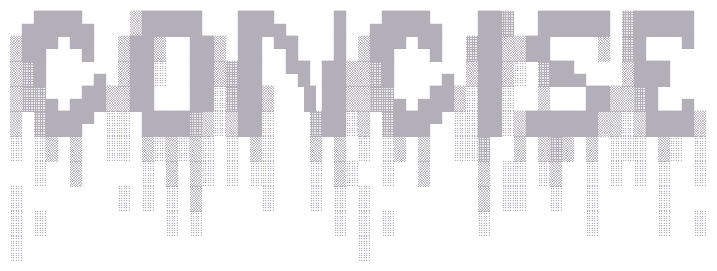
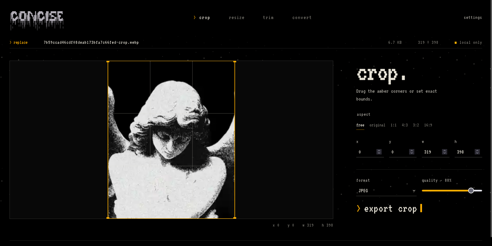

<p align="center">
  
</p>
<p align="center">
  
</p>

<p align="center">
  Private, browser-only tools for the small file jobs that should take seconds.
</p>

<p align="center">
  <a href="https://concise.ai9an.com">concise.ai9an.com</a> -
  <a href="#preview">preview</a>
</p>

## What it is

Concise is a static utility site for quick media, code, and writing jobs. Every operation happens in the browser: files are never uploaded, stored remotely, or sent to an API.

The core loop is deliberately short:

```text
open a local file → adjust it → export a local download
```

## Features
 - image cropping
 - image resizing (to maxium size or pixel count)
 - file converting, [supported formats](#Formats)
 - plain-background removal with transparent or green-screen PNG export
 - optional local AI matte background removal with a cached, browser-run model
 - metadata inspection plus lossless stripping for common images, media, PDF, and office documents
 - QR generation with optional centre images
 - Base64, URL, hex, cipher, hashing, and AES-256-GCM tools
 - Markdown editing with a sanitised live preview and README cheatsheet
 - case conversion for prose and developer naming styles
 - configurable FIGlet ASCII lettering with shared per-glyph colour fades, transparent still PNG, and executable ANSI animations for Bash/Konsole or Python
 - local-first
 - fast exports with quality and format controls

## Privacy and offline behavior

- No file upload endpoint
- No accounts or server-side storage
- No analytics that receive file content
- No runtime CDN dependency for FFmpeg: the multi-threaded core is copied into the static build and split into two deploy-safe WASM chunks
- Precise background removal downloads its permissively licensed model from Hugging Face on first use; the model is cached and inference remains on-device
- Once the page and its local processing assets are loaded, file work continues without a network connection

## Formats

### image:
    jpeg, png, webp, avif, gif, bmp, tiff
### video:
    mp4, webm, mov, mkv, avi, gif
### audio:
    mp3, wav, ogg, flac, m4a


## Run or test locally

Requirements: Node.js 20+ and npm.

```sh
npm install
npm run dev
```

### Quality checks

```sh
npm run typecheck
npm run build
```

## Deploy to Cloudflare

Concise deploys as a Workers Static Assets project. It does not run application code on a server; Cloudflare only serves the files produced in `dist`.

For a Git-connected Cloudflare project, use:

```text
Build command:  npm run build
Deploy command: npx wrangler deploy
Production branch: main
```

The deploy command reads `wrangler.jsonc`, uploads `dist`, and applies the `_headers` rules required by multi-threaded FFmpeg. To deploy from your own computer instead, authenticate Wrangler and run:

```sh
npm run deploy
```

After the first successful deployment, add `concise.ai9an.com` under the Worker's custom domains. Do not configure a separate asset directory or Worker entry point in the dashboard; both are defined by `wrangler.jsonc`.

## Preview

<p align="center">
  
</p>

## Project layout

```text
assets/                 Source brand assets
public/ffmpeg-core/     Locally served multi-threaded FFmpeg core files
src/
  lib/ffmpeg.ts         FFmpeg loader and wrapper foundation
  tools/                Media processing and text-codec logic
  ui/                   Editors, generators, navigation, and shared UI
  styles/               Global visual system and utility workspaces
_headers                Cloudflare security and isolation headers
wrangler.jsonc          Workers Static Assets configuration
```

## Contributing

Keep file processing client-side. Do not add upload endpoints, server-side processing, account requirements, or tracking that can access user file content.

Run `npm run typecheck` and `npm run build` before opening a pull request.

## 

built with [codex](github.com/openai/codex) and [impeccable](https://github.com/pbakaus/impeccable)
